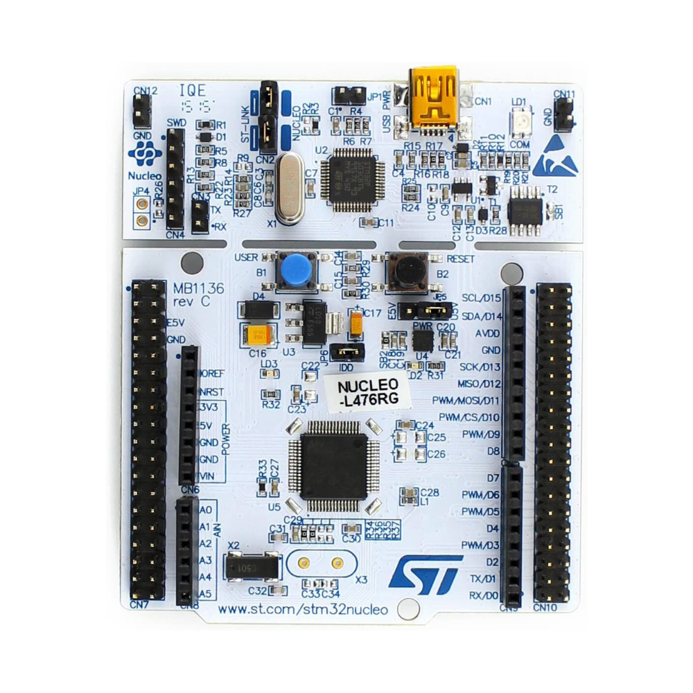
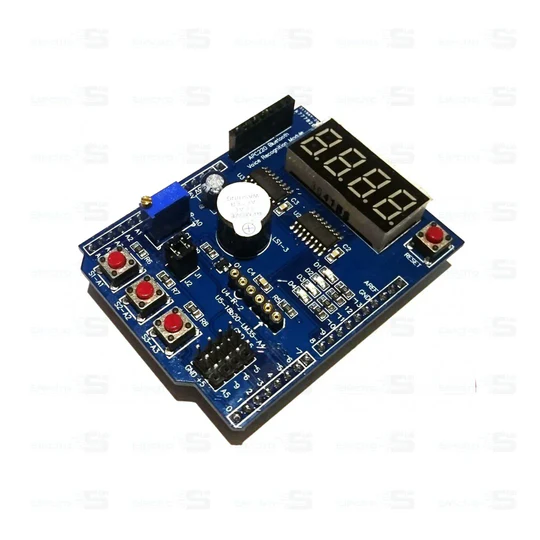
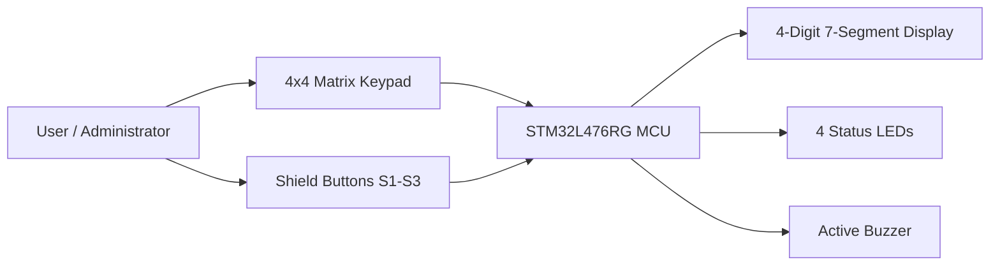
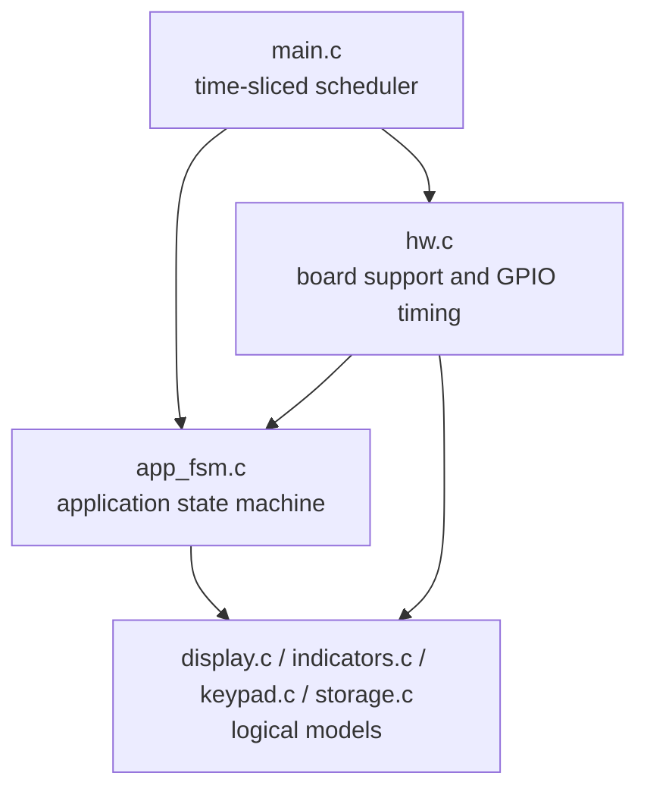
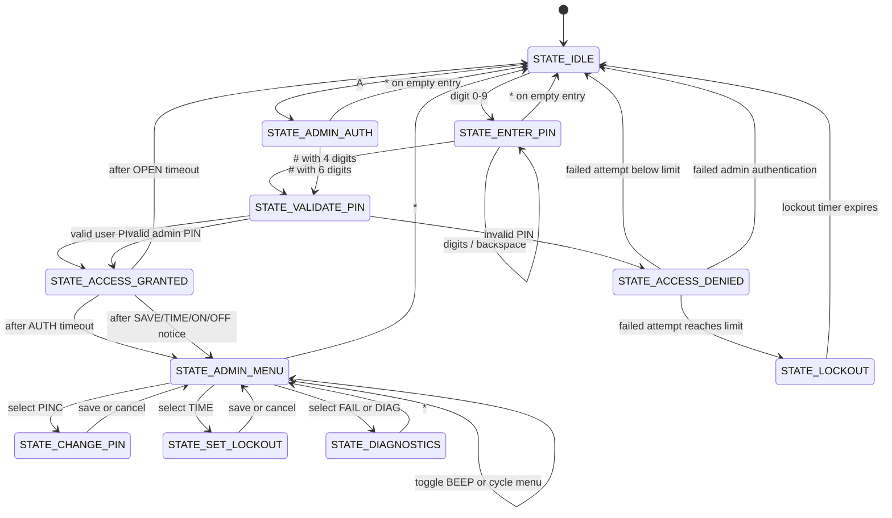

# Safe Project Architecture

## 1. Project Application

This project implements the firmware for a prototype electronic safe controller built on an
STM32 NUCLEO-L476RG. The application combines user authentication, lockout protection,
operator feedback, and a small administrative console in a single embedded control loop.

The current prototype is intended to demonstrate these core behaviors:

- user PIN entry through a 4x4 matrix keypad
- access grant or denial feedback on a 4-digit seven-segment display
- LED and buzzer indication of armed, admin, success, error, and lockout conditions
- configurable lockout after repeated failed attempts
- administrative functions to change the user PIN, adjust lockout time, toggle sound,
  and inspect basic diagnostics

At the application level, the system behaves like a safe front panel:

- normal users enter a 4-digit PIN
- administrators enter a 6-digit PIN to reach a maintenance menu
- the display and indicators continuously reflect the current security state
- the firmware enforces a timed lockout after too many failed user attempts

## 2. Physical Platform

The hardware is organized around three visible elements:

- an STM32 NUCLEO-L476RG development board as the MCU and timing/control platform
- an Arduino-style Multi-Function Shield for display, LEDs, buzzer, and three push buttons
- an external 4x4 matrix keypad connected to free Morpho header pins

### Reference Hardware Images

#### STM32 NUCLEO-L476RG



The NUCLEO-L476RG hosts the STM32L476RG microcontroller, power regulation, debug interface,
and the Arduino plus Morpho headers used by the project.

#### Multi-Function Shield



The shield contributes the four-digit multiplexed display, four LEDs, active buzzer, and
three local buttons used by the firmware as shortcut inputs.

#### 4x4 Matrix Keypad


The matrix keypad is the primary secure input surface. It provides digits `0-9`, control
keys `*` and `#`, and function keys `A-D`.

## 3. Hardware Architecture

### 3.1 System View



### 3.2 Control Partitioning

The firmware uses a clean split between logical state and board-specific I/O:

- `src/app_fsm.c` owns application policy, security states, and user/admin workflows
- `src/hw.c` owns GPIO configuration, keypad scanning, display multiplexing, LEDs, buzzer,
  and low-power waiting
- `src/display.c`, `src/indicators.c`, `src/keypad.c`, and `src/storage.c` hold logical
  models that decouple the application from direct register access

This separation matters because the safe logic can be validated without needing physical
hardware, while the hardware layer remains responsible for timing-sensitive electrical work.

### 3.3 Hardware Blocks and Responsibilities

| Block | Role in the system | Firmware boundary |
| --- | --- | --- |
| STM32L476RG | Main controller, scheduler clock, GPIO host | `src/main.c`, `src/hw.c` |
| Multi-Function Shield display | 4-digit numeric and text feedback | `src/display.c` + display drive logic in `src/hw.c` |
| Shield LEDs | Status indication for armed/admin/success/error/lockout | `src/indicators.c` + LED mapping in `src/hw.c` |
| Shield buzzer | Audible keypress and alarm feedback | `src/indicators.c` + buzzer pulse logic in `src/hw.c` |
| Shield push buttons | Shortcut inputs mapped to `A`, `#`, and `*` | button debounce logic in `src/hw.c` |
| 4x4 keypad | Main user/admin input surface | matrix scan and debounce logic in `src/hw.c` |

### 3.4 Wiring and I/O Mapping

The implementation in `src/hw.c` defines the active hardware mapping used by the prototype.

#### Shield connections

| Function | MCU pin | Notes |
| --- | --- | --- |
| Shift register latch | `PB5` | Shield display drive |
| Shift register clock | `PA8` | Shield display drive |
| Shift register data | `PA9` | Shield display drive |
| Buzzer | `PB3` | Active-low behavior selected in `config.h` |
| LED1 | `PA5` | Used in error and lockout patterns |
| LED2 | `PA6` | Used for armed/admin patterns |
| LED3 | `PA7` | Used for admin patterns |
| LED4 | `PB6` | Used for success indication |
| Shield button S1 | `PA1` | Injected as key `A` |
| Shield button S2 | `PA4` | Injected as key `#` |
| Shield button S3 | `PB0` | Injected as key `*` |

#### External keypad connections

| Keypad signal | MCU pin |
| --- | --- |
| Row 1 | `PC10` |
| Row 2 | `PC11` |
| Row 3 | `PC12` |
| Row 4 | `PD2` |
| Column 1 | `PC8` |
| Column 2 | `PC6` |
| Column 3 | `PC5` |
| Column 4 | `PC4` |

The keypad map is the standard 4x4 arrangement:

```text
1 2 3 A
4 5 6 B
7 8 9 C
* 0 # D
```

### 3.5 Electrical Interaction Model

The hardware layer performs these low-level tasks:

- configures GPIO for output, pull-up input, or analog high-impedance mode
- scans keypad rows against pulled-up columns and accepts exactly one stable pressed key
- debounces both keypad and shield buttons before generating logical key events
- multiplexes the four display digits at a fixed refresh cadence
- converts ASCII characters into seven-segment patterns
- drives LED patterns according to logical application state
- pulses the buzzer for keypress, success, error, or periodic lockout feedback
- sleeps with `__WFI()` between scheduled activities to reduce unnecessary CPU activity

One notable implementation detail is the buzzer idle strategy: when the buzzer is silent, its
pin is parked in analog mode so the shield sees a high-impedance state rather than a guessed
inactive logic level.

## 4. Firmware Architecture

### 4.1 Layered View



### 4.2 Main Execution Model

The firmware is single-threaded and built around a deterministic superloop. `main()` performs
three periodic activities using millisecond time derived from SysTick:

| Activity | Period | Purpose |
| --- | --- | --- |
| input scan | `1 ms` | poll keypad and shield buttons |
| app tick | `50 ms` | process queued key events and advance the state machine |
| display/output refresh | `2 ms` | multiplex display digits and apply LED/buzzer outputs |

This gives the design a clear separation of concerns:

- input acquisition is fast enough to support debouncing and responsive typing
- application policy stays coarse-grained and easier to reason about
- display multiplexing remains independent from business logic timing

### 4.3 Firmware Data Flow


### 4.4 Core Modules

#### `src/main.c`

Provides the scheduler shell:

- initializes the hardware boundary and application model
- tracks last execution time for each periodic task
- runs periodic input polling, application ticking, and output refresh
- enters low-power wait between events

#### `src/app_fsm.c`

Implements the safe's control policy as a finite-state machine. It is the main source of truth
for security behavior and operator interaction.

Main responsibilities:

- accept logical key events
- validate user and admin PINs
- maintain state transitions and timeouts
- control lockout behavior
- manage admin menu actions
- render the logical display text and indicator patterns

#### `src/storage.c`

Stores mutable configuration and counters:

- user PIN
- admin PIN
- lockout duration
- sound enabled flag
- maximum failed attempts
- failed-attempt counter

Important limitation: storage is currently volatile RAM only. Power cycling resets the values to
their defaults. The module is intentionally shaped so non-volatile persistence can replace it
later without changing the application contract.

#### `src/keypad.c`

Provides a bounded key event queue. This prevents the state machine from depending directly on
scan timing and gives the application one stable input abstraction.

#### `src/display.c`

Maintains a logical four-character display buffer with helpers for:

- fixed text
- numeric rendering
- masked progress display during PIN entry

#### `src/indicators.c`

Maintains the logical LED and buzzer intent chosen by the state machine, including enforcement of
the global sound enable flag.

#### `src/hw.c`

Translates logical display and indicator intent into physical GPIO behavior and converts physical
input activity into stable logical key events.

### 4.5 Application States

The safe controller uses these states:

| State | Meaning |
| --- | --- |
| `STATE_IDLE` | armed and waiting for user input |
| `STATE_ENTER_PIN` | user PIN entry in progress |
| `STATE_VALIDATE_PIN` | PIN verification step |
| `STATE_ACCESS_GRANTED` | transient success state |
| `STATE_ACCESS_DENIED` | transient failure state |
| `STATE_LOCKOUT` | timed lockout after too many failed attempts |
| `STATE_ADMIN_AUTH` | admin PIN entry |
| `STATE_ADMIN_MENU` | operator menu selection |
| `STATE_CHANGE_PIN` | user PIN update workflow |
| `STATE_SET_LOCKOUT` | lockout duration configuration workflow |
| `STATE_DIAGNOSTICS` | simple status and failure-count view |

### 4.6 State Transition View



### 4.7 User and Admin Interaction Model

#### User path

1. The display shows `SAFE`.
2. The user enters four digits.
3. `#` submits the PIN.
4. A valid PIN shows `OPEN` and success feedback.
5. An invalid PIN shows `FAIL`.
6. After `MAX_FAILED_ATTEMPTS`, the safe enters timed lockout and the display shows the
   remaining seconds.

#### Admin path

1. The operator enters admin mode with `A`.
2. A 6-digit admin PIN is entered and submitted with `#`.
3. On success, the firmware enters `STATE_ADMIN_MENU`.
4. `B` and `C` cycle forward and backward through menu items.
5. `#` activates the selected function.
6. `*` returns to idle or backs out of the current admin workflow.

Admin menu functions currently available:

- `PINC`: change the user PIN
- `TIME`: set lockout duration in seconds
- `BEEP`: enable or disable sound feedback
- `FAIL`: show failed-attempt count
- `DIAG`: show sound status and lockout time summary

## 5. Security-Relevant Behavior

The current implementation already includes several safe-controller protections:

- fixed-length validation for both user and admin PINs
- bounded keypad queue capacity
- debounced physical inputs before key acceptance
- rejection of unsupported keys at the queue boundary
- automatic failed-attempt tracking
- timed lockout after the configured threshold
- explicit separation between normal-user and admin workflows

Current prototype limits to be aware of:

- credentials are stored only in volatile memory
- there is no tamper sensing, enclosure switch, or secure element
- PIN comparison is functional rather than hardened against side-channel analysis
- the design is a control-panel prototype, not a certified high-security safe product

## 6. Relevant Source Map

| Concern | Path |
| --- | --- |
| application logic / state machine | `src/app_fsm.c`, `include/app_fsm.h` |
| hardware boundary | `src/hw.c`, `include/hw.h` |
| display model | `src/display.c`, `include/display.h` |
| indicator model | `src/indicators.c`, `include/indicators.h` |
| keypad queue | `src/keypad.c`, `include/keypad.h` |
| configuration and limits | `include/config.h` |
| mutable settings | `src/storage.c`, `include/storage.h` |
| logic tests | `test/test_safe_logic.c` |

## 7. Summary

This repository implements a compact but well-partitioned embedded safe controller:

- hardware-specific code is isolated in the board support layer
- security and operator behavior are concentrated in a finite-state machine
- logical models decouple policy from display and GPIO details
- the prototype is already suitable for demonstration, validation, and extension toward
  persistent storage or actuator integration

For the current project scope, Markdown with embedded images and Mermaid diagrams is the most
appropriate documentation format because it is version-controlled, reviewable with the code,
easy to extend, and well-suited to architecture communication in embedded projects.
